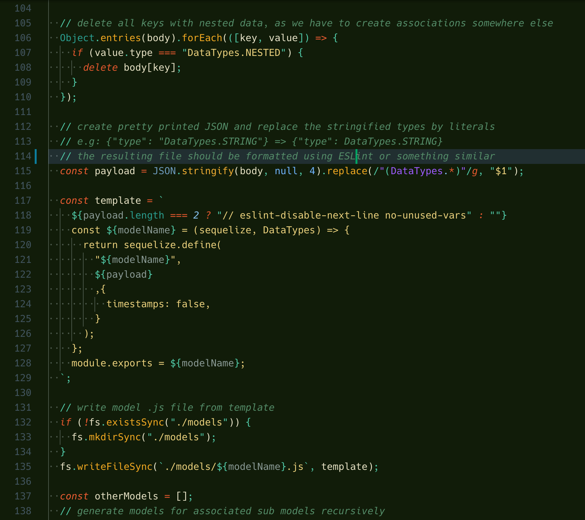
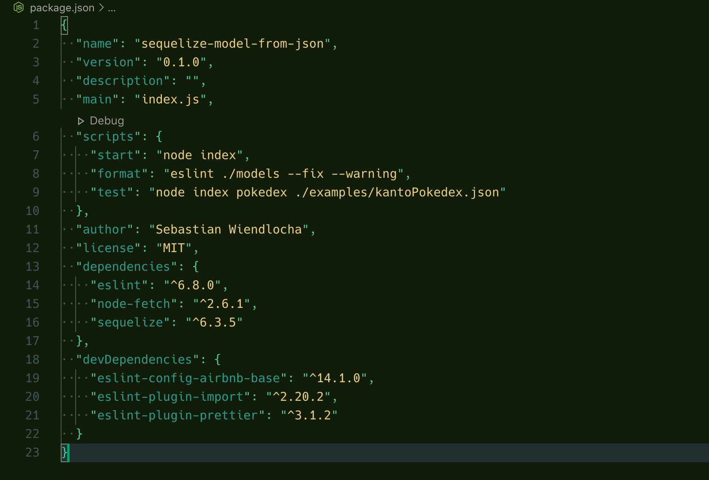
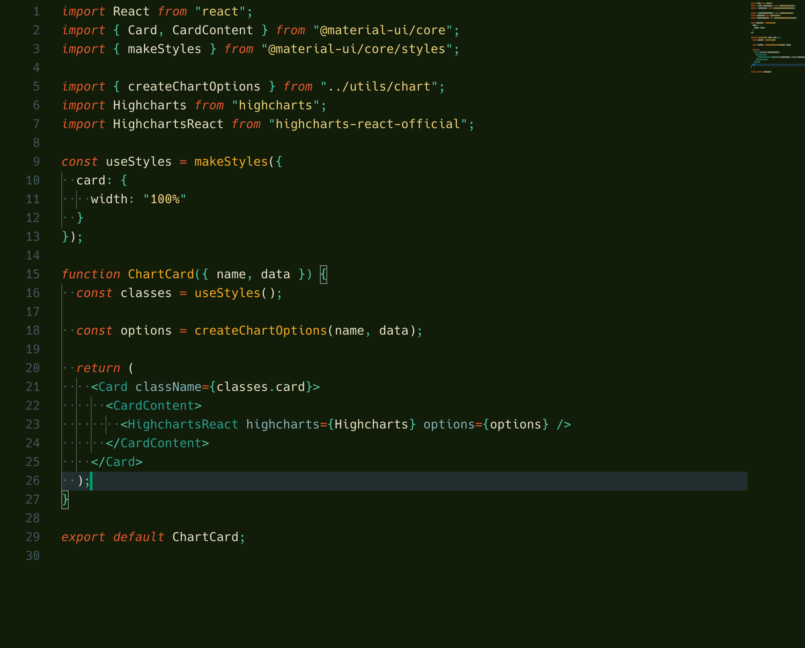
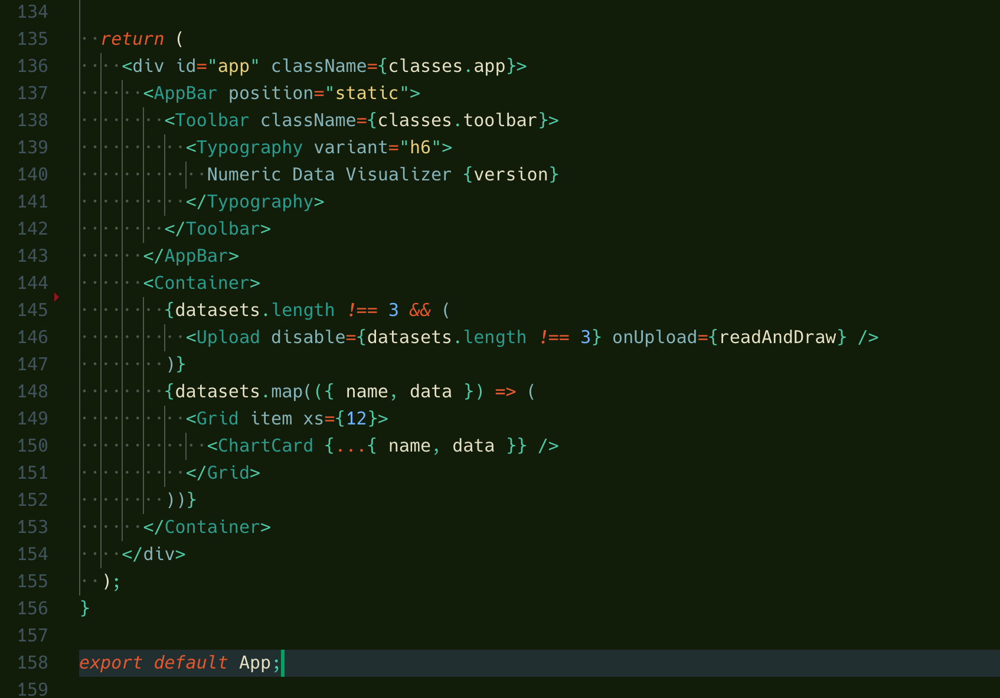
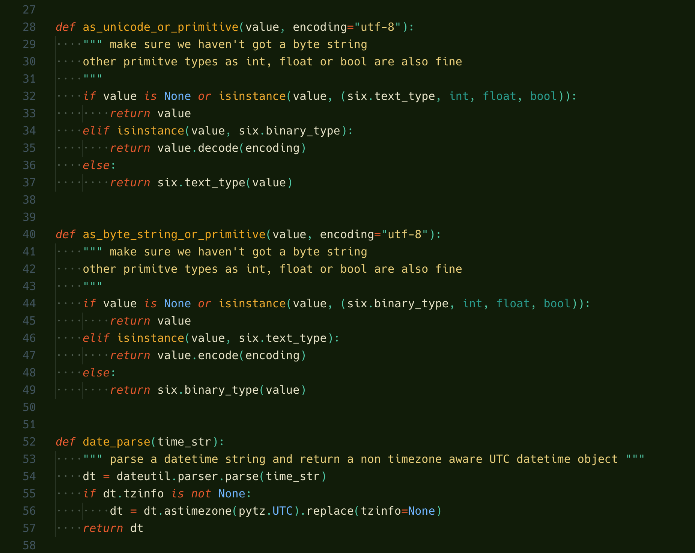

# 'Phnx Retro' VSCode Theme

This is my personal VSCode theme, based on the [Colorsublime](https://github.com/Colorsublime/Colorsublime-Themes) ["Birds of Paradise" theme](https://github.com/Colorsublime/Colorsublime-Themes/blob/master/themes/Birds_of_Paradise.tmTheme)
and adapted for my personal use.

## Install
see [VScode theme installation guide](https://code.visualstudio.com/docs/getstarted/themes).
On MacOS you basically just have to copy the `theme-phnx` folder into your 
`~/.vscode/extensions` folder.

## Screenshots

### JS

### JSON

### React

### Python

