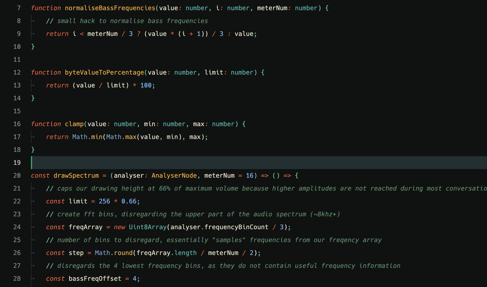

# 'Phnx Retro' VSCode Theme

This is my personal VSCode theme, based on the [Colorsublime's](https://github.com/Colorsublime/Colorsublime-Themes) ["Birds of Paradise" theme](https://github.com/Colorsublime/Colorsublime-Themes/blob/master/themes/Birds_of_Paradise.tmTheme)
and adapted for my personal use.

## Install

### MacOS / Linux

copy the `theme-phnx` folder into your `~/.vscode/extensions` directory. Start VScode and select the "PhnxRetro" theme in your user settings.

### Windows

copy the `theme-phnx` folder into your `%USERPROFILE%\.vscode\extensions` directory. Start VScode and select the "PhnxRetro" theme in your user settings.

## Screenshots

### TS

